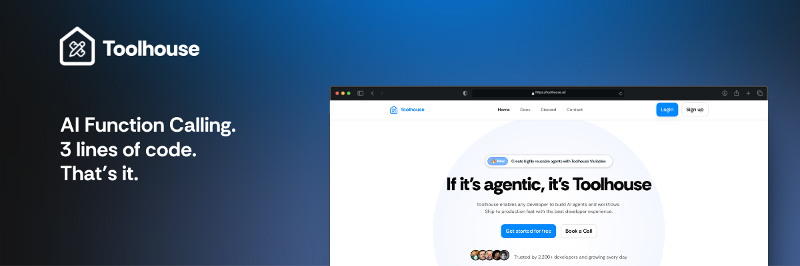

**Toolhouse** is the first cloud platform that allows developers to quickly build, manage, and run **AI function calling**. We take care of every aspect of connecting AI to the real world, from performance optimization to prompting to integrations with all foundational models, in just **three lines of code**.

- ✅ Easy Implementation
- ✅ Universal SDK
- ✅ Fast and Secure
- ✅ Built for Privacy
- ✅ Fantastic Developer Experience

 

<video controls src="assets/Toolhouse Intro.mp4" title="Title"></video>

 

## Resources

 - 📑 [Read the Documentation](https://docs.toolhouse.ai)
 - 🏃 [Run Experiments on the Toolhouse Playground](https://toolhouseplayground.streamlit.app)
 - 🌱 [Join the Toolhouse Community on Discord](https://discord.gg/jWDzFNXWS4)
